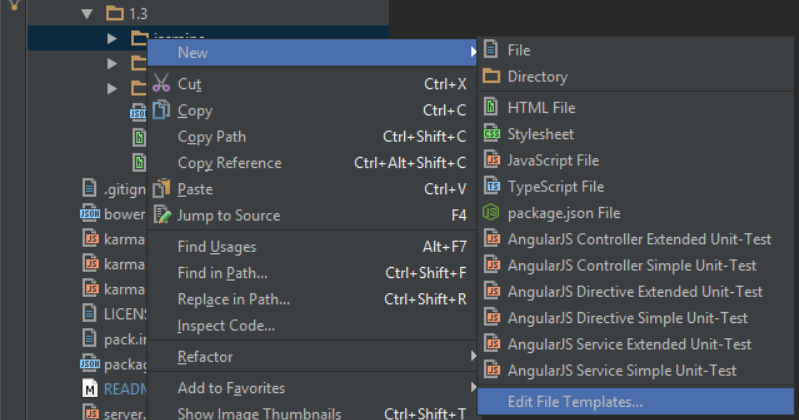
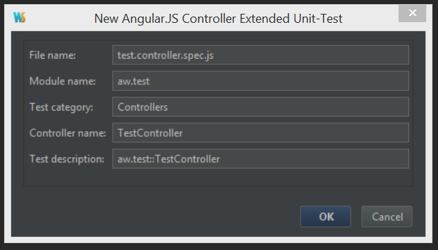
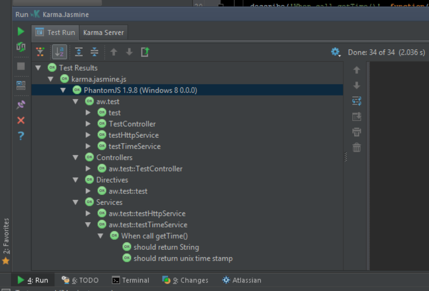

# webstorm-angular-unittest-templates
WebStorm file templates for unit-testing of applications based on [AngularJS](https://angularjs.org/). This set of templates for controllers, directives and services is designed to minimize time needed to expand environment when new test cases should be created. There are two types of templates

 - Extended -- full list of mocks/tools I use often in testing, after creating new test, there probably will be something to remove.
 - Simple -- lightweight template with things that needed most in testing, usually nothing removed and lots added.

Everything you need is in `/bin/` folder, or `/1.3/` if you want to check templates code. I'm using these templates for application that was built with AngularJS 1.3, but this does not mean you cannot use it with any version of AngularJS. Some tweeking might be required, also [#self-tests](#self-tests)  might come handy.

> **Note:** Templates do not contain framework-specific code(there are no assertions defined), so should work fine with most test frameworks. Currently [Jasmine](http://jasmine.github.io/) and [Mocha](http://mochajs.org/) tested.

## Contents
This repo includes WebStorm templates in `1.3/` folder for [AngularJS](https://angularjs.org/) 1.3 unit-testing and test project, that was covered with unit-tests using these templates. Currently in use two Karma configs for [Mocha](http://mochajs.org/) + [Chai](http://chaijs.com/) + [Sinon.JS](http://sinonjs.org/) and [Jasmine](http://jasmine.github.io/) testing frameworks.
`tests/1.3` folder contains  

 - `/src` -- test project that should be covered with unit-tests
 - `/mocha` -- Unit-tests written using Mocha + Chai + Sinon.JS frameworks.
	 - `mocha/simple` -- simple templates used for testing project
	 - `mocha/extended` -- extended templates used for testing project
 - `jasmine` -- Unit-tests written using Jasmine framework, has same folders inside, as `/mocha/*`.

## Install
To add templates to your WebStorm, [do these steps](https://www.jetbrains.com/webstorm/help/exporting-and-importing-settings.html):

1. Download [JAR archive with templates](https://raw.githubusercontent.com/burdiuz/webstorm-angular-unittest-templates/master/bin/unittest_templates_angular13.jar)
2. Open WebStorm
3. File > Import Settings
4. In the "Import File Location" dialog box that opens, select downloaded archive
5. In the "Select Components to Import" dialog box that opens, specify "File Templates" to be imported, and click OK

>**Note:** This will add all available templates to your WebStorm File > New menu. You can remove unused or change them in "File and Code Templates" settings panel.

Alternatively you can add templates by hand using "File and Code Templates" settings panel.

1. Open WebStorm
2. File > Settings... (Ctrl+Alt+S) > Editor > File and Code Templates
3. Select "Templates" tab
4. Click on green plus button
5. Specify name of your template, extension to be "js"
6. Copy-paste code from file template
7. Apply

> **Note:** After adding templates you can create new files from templates via File > New... (Alt+Insert) menu or context "New" menu of Project panel.


## Parameters
When creating new file from template WebStorm will ask you for file name and additional information:

>#### Controller
 - Module name -- angular module of controller
 - Controller name -- controller name in angular  

>#### Directive
 - Module name -- angular module of controller
 - Directive HTML name - directive HTML name, the one with dashes  

>#### Service
 - Module name -- angular module of controller
 - Service name -- service name registered in angular
 
Extended template for controller, directive and service supports optional parameters  

> - Test category -- 1st nesting level for test cases, if not specified, angular module will be used as test category
> - Test description -- 2nd nesting level for test cases, if not specified, specified name of controller/directive/service will be used as test description   


 
## #self-tests
This is simple test cases to test created environment, they may be used to know if environment was created properly. Just insert them into templates and run after new file from template was created. After first successful run #self-test can be removed.
### Jasmine
>#### Controller
 ```javascript
      it('#self-test', function() {
        expect(${DS}scope).toBeTruthy();
        expect(controller).toBeTruthy();
      });
 ```
>#### Directive
 ```javascript
      it('#self-test', function() {
        expect(${DS}parentScope).toBeTruthy();
        expect(element).toBeTruthy();
        expect(controller).toBeTruthy();
        expect(${DS}scope).toBeTruthy();
      });
 ```
>#### Service
 ```javascript
      it('#self-test', function() {
        expect(service).toBeTruthy();
      });
 ```
 
### Chai
>#### Controller
 ```javascript
      it('#self-test', function() {
        expect(${DS}scope).to.be.ok;
        expect(controller).to.be.ok;
      });
 ```
>#### Directive
 ```javascript
      it('#self-test', function() {
        expect(${DS}parentScope).to.be.ok;
        expect(element).to.be.ok;
        expect(controller).to.be.ok;
        expect(${DS}scope).to.be.ok;
      });
 ```
>#### Service
 ```javascript
      it('#self-test', function() {
        expect(service).to.be.ok;
      });
 ```  

## Links  

[AngularJS WebStorm live templates](https://github.com/angularjs-livetpls/angularjs-webstorm-livetpls)  

[An Introduction To Unit Testing In AngularJS Applications](http://www.smashingmagazine.com/2014/10/introduction-to-unit-testing-in-angularjs/)  

> Written with [StackEdit](https://stackedit.io/).